# Procesverslag
Markdown is een simpele manier om HTML te schrijven.  
Markdown cheat cheet: [Hulp bij het schrijven van Markdown](https://github.com/adam-p/markdown-here/wiki/Markdown-Cheatsheet).

Nb. De standaardstructuur en de spartaanse opmaak van de README.md zijn helemaal prima. Het gaat om de inhoud van je procesverslag. Besteedt de tijd voor pracht en praal aan je website.

Nb. Door *open* toe te voegen aan een *details* element kun je deze standaard open zetten. Fijn om dat steeds voor de relevante stuk(ken) te doen.

## Jij

  
uitwerken voor kick-off werkgroep

  ### Auteur:
 Jillian Wong

  #### Je startniveau:
 Blauw/rood

  #### Je focus:
 Responsive 
 

## Je website

  
uitwerken voor kick-off werkgroep

  ### Je opdracht:
 https://crayolaexperiencemn.com/

  #### Screenshot(s) van de eerste pagina (small screen): 
  Home pagina van Crayola Experience
  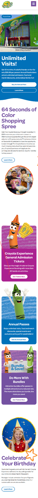

  #### Screenshot(s) van de tweede pagina (small screen):
  Visiting pagina van Crayola Experience
  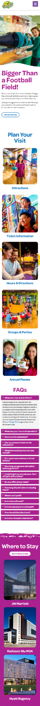
 

## Toegankelijkheidstest 1/2 (week 1)

  
uitwerken na test in 2e werkgroep

  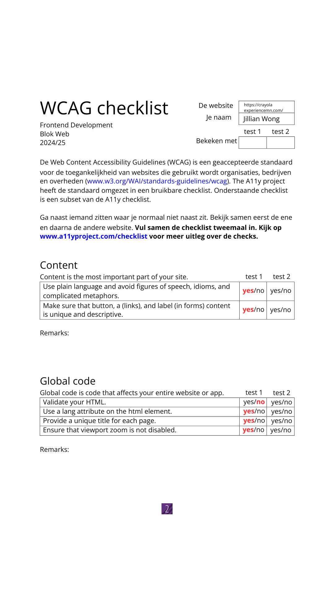
  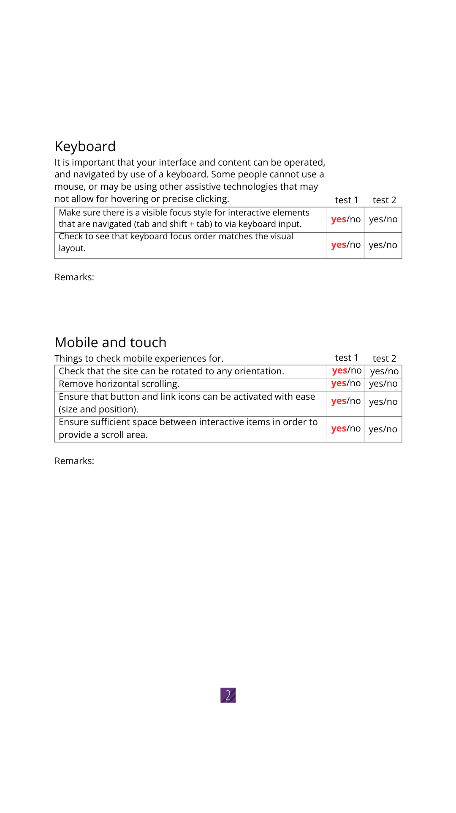
  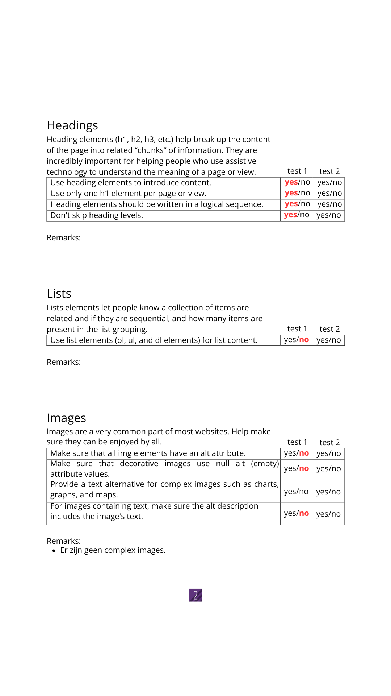
  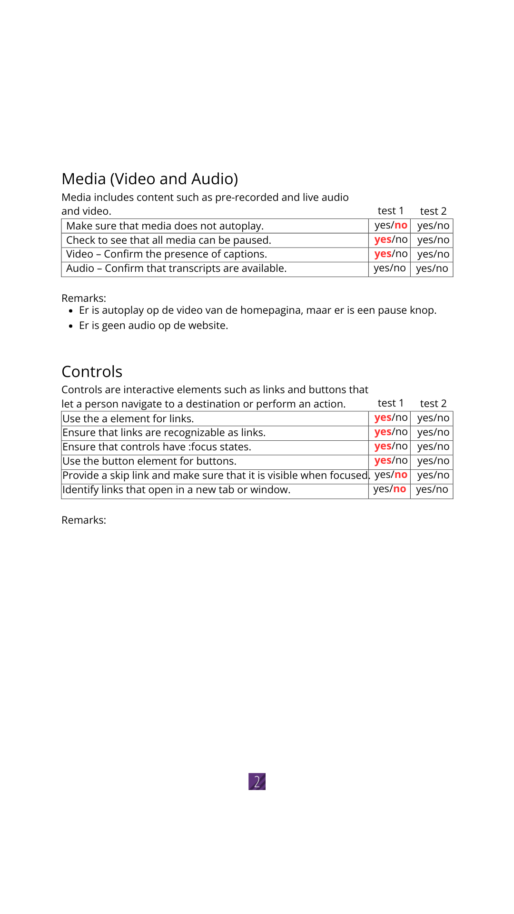
  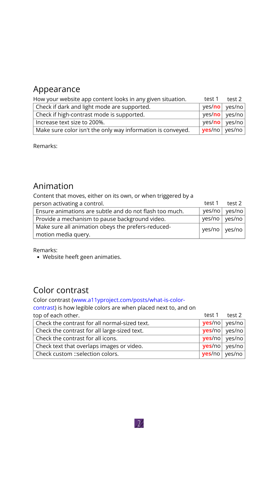

  ### Bevindingen
  Lijst met je bevindingen die in de test naar voren kwamen:
  - De website kon niet gevalideert worden in de W3C validator, hij geeft een error.
  - Ik heb opgemerkt dat er geen dark mode thema is, wat ik eigenlijk wel had verwacht van zo'n officiele/professionele website.
  - Er komen geen animations voor wat ik ook had verwacht bij zo'n website waarbij de thema kinderachtig is.
  - De website gebruikt veel divjes voor vormgeving.

## Breakdownschets (week 1)

  
uitwerken na afloop 3e werkgroep

  ### de home pagina: 
  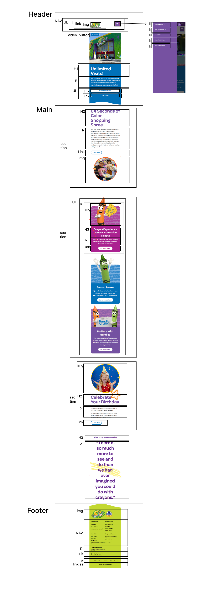

  ### de visiting pagina: 
  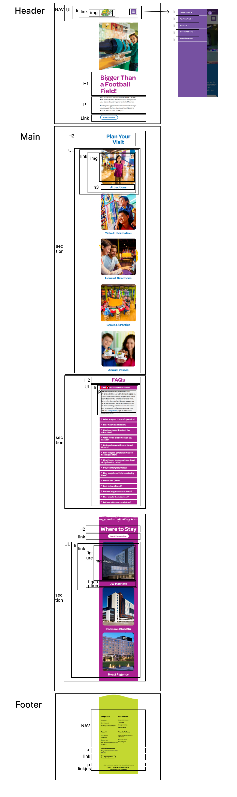

## Voortgang 1 (week 2)

  
uitwerken voor 1e voortgang

  ### Stand van zaken
 Ik heb voor de eerste voortgangsgesprek mijn HTML van beide pagina's af kunnen hebben. Ik heb tijdens het opmaken van deze code geen problemen gehad.

  ### Agenda voor meeting
  samen met je groepje opstellen

  | student 1      | student 2          | student 3    | student 4        |
  | ---            | ---                | ---          | ---              |
  | Hoe kan ik de  | Wat gebeurt er als | Was afwezig  | Was afwezig      |
  | video van mijn | je je code af hebt |              |                  |
  | site           | en de website 
  | downloaden?    | veranderd?

  ### Verslag van meeting
  De uitkomsten van de meeting vastleggen

Ik had niet zo zeer fouten in mijn code, ik kreeg wel advies over hoe ik bepaalde stukjes kan coderen:
- Voor de FAQ kan ik het details-element gebruiken.
- De lijst met tickets en Crayola-icoontjes kan ik structureren als article-elementen.
- Voor de achtergrond kan ik het ::before-attribuut in CSS toepassen.
- Een media query kan ik gebruiken om het hamburgermenu te implementeren.
- De nav boven de h1 is niet problematisch voor screenreaders.

Antwoorden op gestelde vragen:
- De video kan je halen uit de dev. tools> network> type> video zoeken> downloaden.
- Het is niet erg als de website verandered. Ik ga kijken naar de screenshots, dus  je kan de oude versie namaken. Als er animaties zijn kan je de Wayback machine gebruiken om de oude versie van de website te zien.

## Voortgang 2 (week 3)

  
uitwerken voor 2e voortgang

  ### Stand van zaken
  Ik heb de CSS van mijn eerste pagin af en heb een begin gemaakt aan de tweede pagina. Ik heb hiervoor een paar vragen die ik hieronder zal uitschrijven.

  ### Agenda voor meeting
  samen met je groepje opstellen

  | student 1      | student 2          | student 3       | student 4        |
  | ---            | ---                | ---             | ---              |
  | Mag je s css   | Is het een vereiste| Waarvoor        | Ze had geen      |
  | stylesheets    | om je menu werkend | gebruik je      | vragen, want der |
  | gebruiken ?    | te krijgen?        | padding en      | website was nog  |
  |                |                    | waarvoor margin | niet zover       |

  ### Verslag van meeting

  hier na afloop snel de uitkomsten van de meeting vastleggen

  Mijn niet algemene vragen:
  - Is mijn ⁠Footer nav in html nesting goed?
  - ⁠Zo ja hoe kan ik 2 rijtjes naast elkaar zetten en wanneer het groter wordt dat ze allemaal naast    elkaar veranderen (responsive laten bewegen)
  - ⁠Mag de div als container voor de video gebruik worden - Ik heb dit geplaatst voor een container voor die button.

  Antwoorden op de gestelde vragen en feedback:
  - Je mag 2 stylesheets gebruiken, maar voor deze opdracht en mijn websit is het niet zo zeer nodig.
  - Footer nav ul moet je tot sections maken ⁠en dan met flex wrap naast elkaar plaatsen en media query gebruiken zodat het responsive word.
  -  class is goed toegepast het mag. Je mag bij een section als je dezelfde ding wil laten doen voor beide pagina’s een class ook toevoegen.
  -  ⁠div van de video mag want het is puur voor styling.
  -  ⁠h1 moet altijd gaan over de gehele site dus de h1 kan crayola experience zijn en dan in css op visually-hidden zetten zodat het onzichtbaar wordt, maar voor de screenreader zal het nog opgelezen worden.
  - verder ziet je ReadMe goed uit en breakdown schetsen ook. De html en css structuur zien ook goed uit.
  - Alt tekstjes nog bijzetten bij imgs
  - Antwoord op student 2 der vraag: Ja het is een vereiste en je kan ook animaties toevoegen.
  - Antwoord op student 3 zijn vraag: Padding gebruiken voor binnen en margin voor buiten wit-ruimte.

## Toegankelijkheidstest 2/2 (week 4)

  
uitwerken na test in 9e werkgroep

  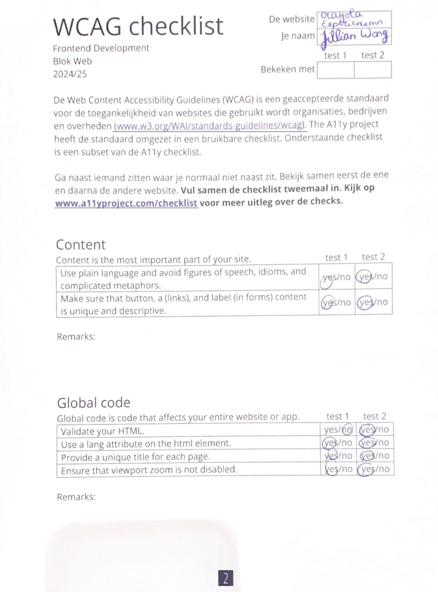
  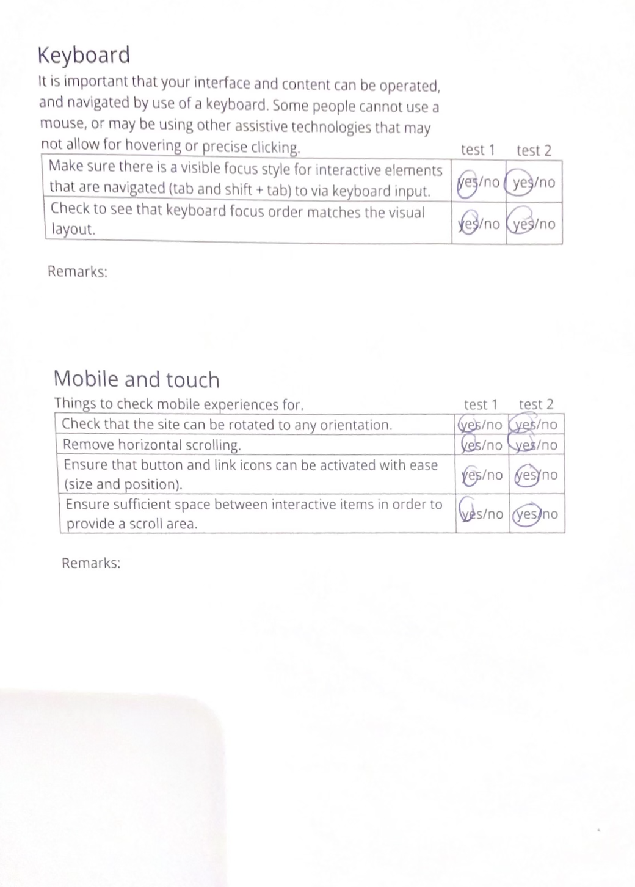
  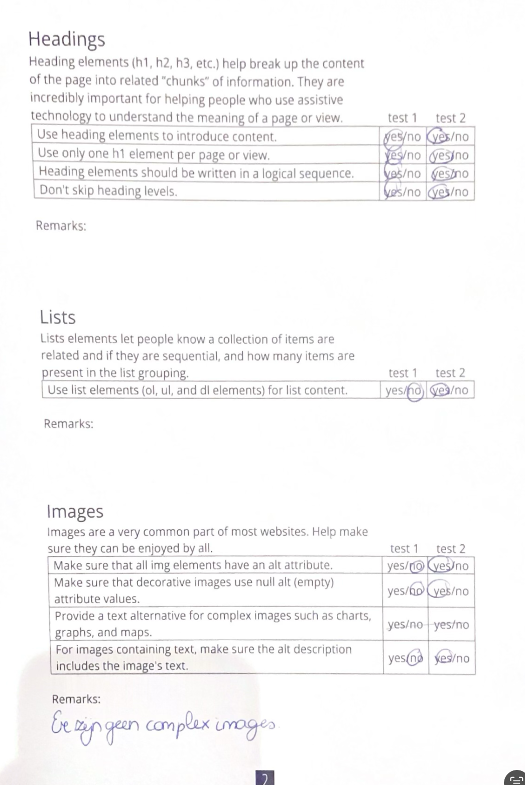
  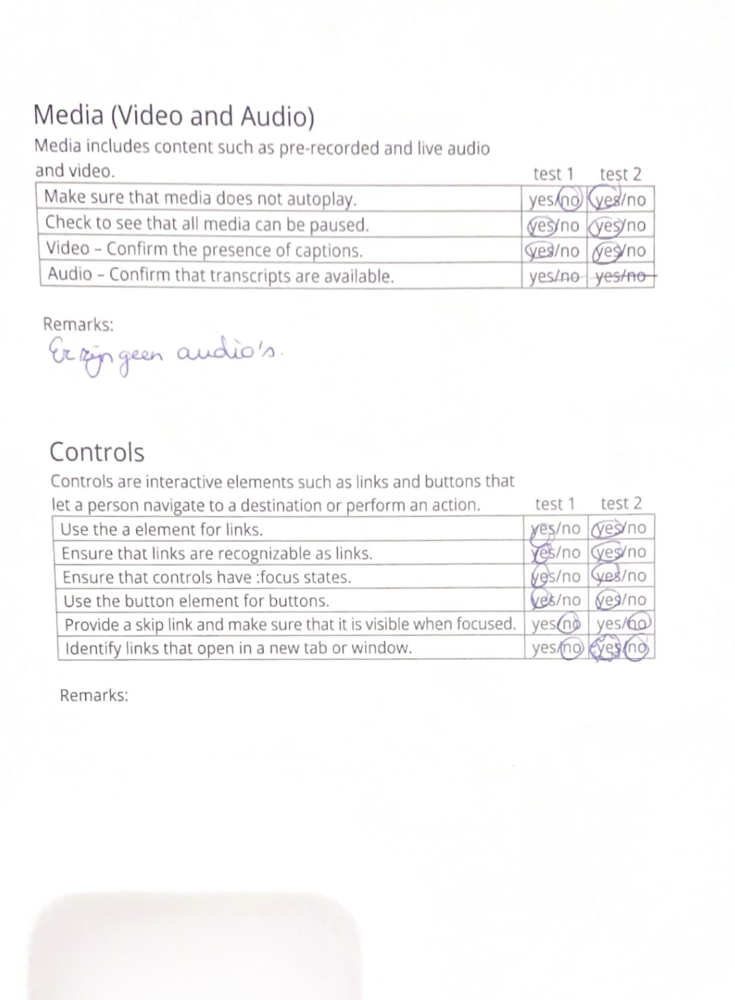
  

  ### Bevindingen
  Lijst met je bevindingen die in de test naar voren kwamen (geef ook aan wat er verbeterd is):
  - De linkjes en buttons hebben duidelijke namen waardoor je weet wat je moet doen wanneer je erop bent met de screen reader.
  - Ik heb goed gebruik gemaakt van de Headings, dus h1,h2,h3 (eentje is niet overgeslagen).

  Wat ik heb verbeterd:
  - Mijn website valideert wel in W3C.
  - Ik heb een dark-mode thema toegevoegd.
  - Ik heb probeert om zo min mogelijk divjes te gebruiken, en wanneer ik ze toch heb gebruikt, heb ik ervoor gezorgd dat het puur voor styling is.
  - Er is geen autplay bij de video.
  - Ik heb gebruik gemaakt van List items voor list content.

## Voortgang 3 (week 4)

  
uitwerken voor 3e voortgang

  ### Stand van zaken
  Ik heb voor dit gesprek het overgrootste deel van mijn code af, ik heb alleen nog een paar vragen die ik wil stellen die ik hieronder zal uitschrijven.

  Ik heb vragen over deze stukken code:
    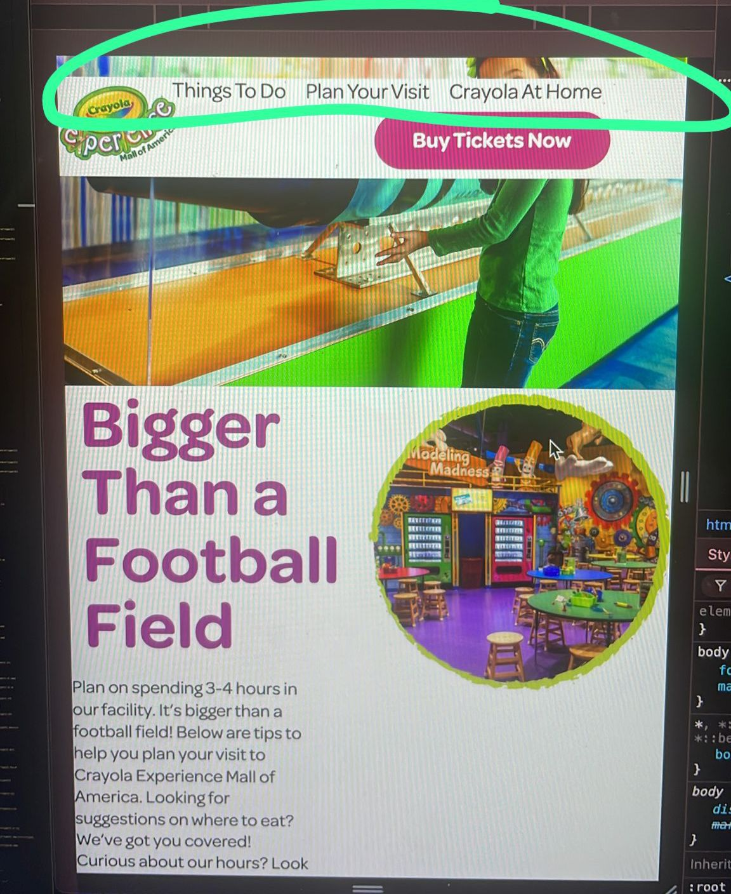
    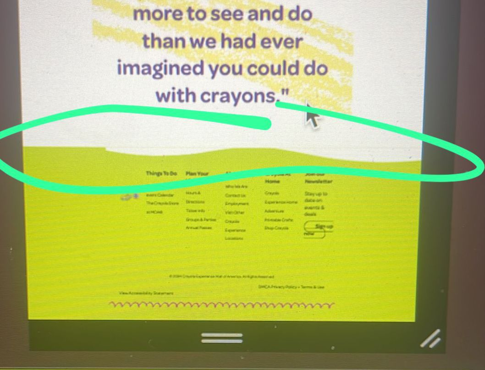
    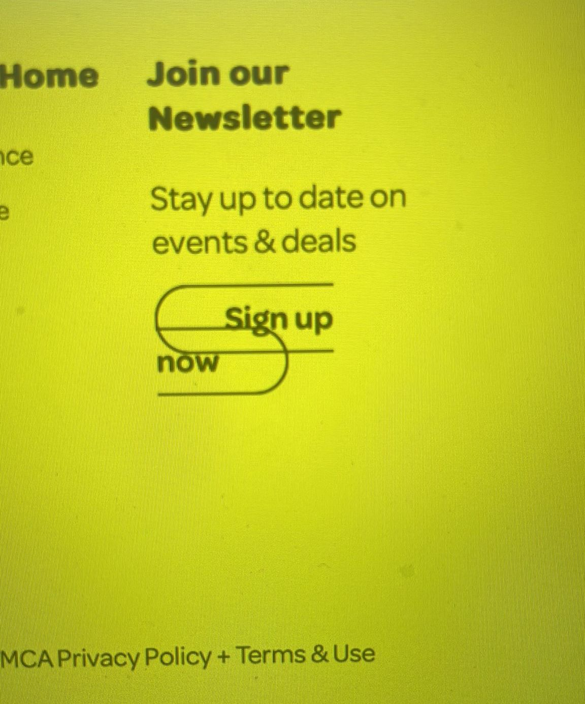
    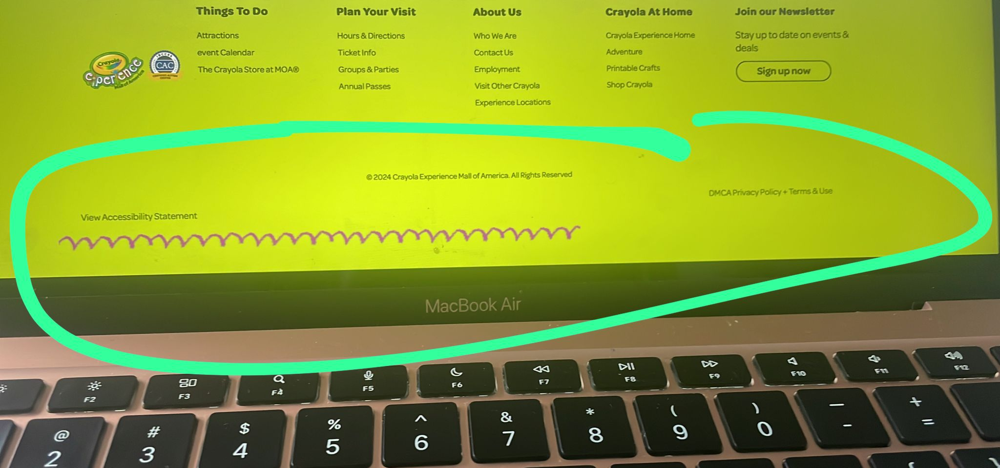
    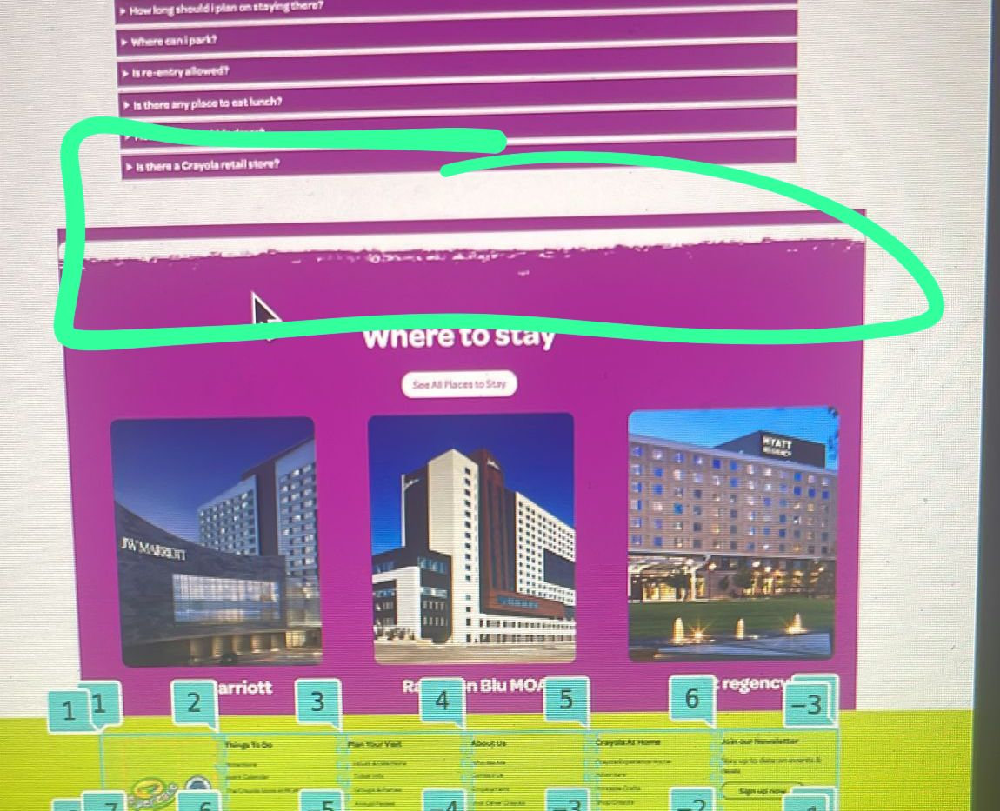

  ### Agenda voor meeting
  samen met je groepje opstellen

  | student 1      |
  | ---            |
  | Ik had voor dit| 
  | gesprek alleen | 
  | vragen over m'n|  
  | eigen code.    |

  => andere studenten waren afwezig

  ### Verslag van meeting
  hier na afloop snel de uitkomsten van de meeting vastleggen

  - Ik kreeg als feedback dat mijn website al redelijk af eruit ziet, alleen een paar finishing touches had het nodig.
  - Ik stelde specifieke vragen over mijn code, waar ik gelijk hulp kreeg. Ik heb deze code dan thuis verbeterd.
  - Ik had ook gevraagd als ik de styling van de navigatie moet nadoen sins ik responsive heb gekozen, en ik kreeg als antwoord, ja die hover nav styling kan wel erbij. Ik kreeg hiervor ook hulp hoe ik het zou kunnen uitvoeren.
  - Ik kreeg ook als feedback dat ik me dark mode eerst in orde moet maken voordat ik de nav styling doe, want die is belangrijker.

## Eindgesprek (week 5)

  
uitwerken voor eindgesprek

  ### Je uitkomst - karakteristiek screenshots:
  Ik ben erg trots op het resultaat van de homepage, omdat het de stijl van de originele website echt goed weergeeft. Ik heb hier veel tijd en moeite in gestoken om het er zo goed mogelijk uit te laten zien.
  

  ### Dit ging goed/Heb ik geleerd: 
  
  Ik heb geleerd hoe ik met Grid content kan verplaatsen en ook responsive laten bewegen.

  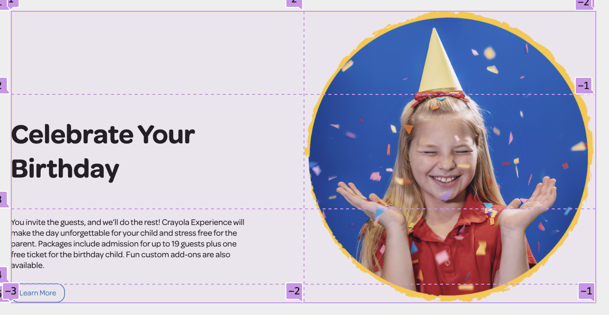

  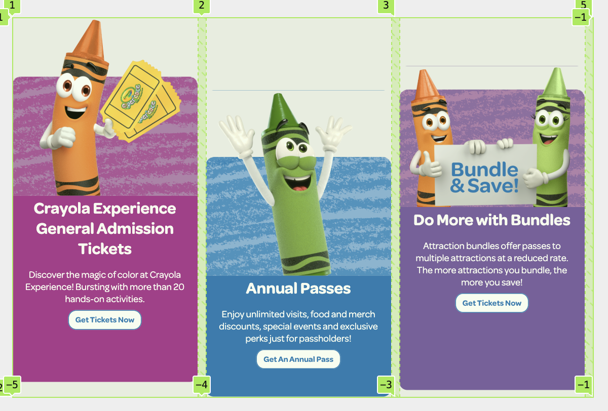

  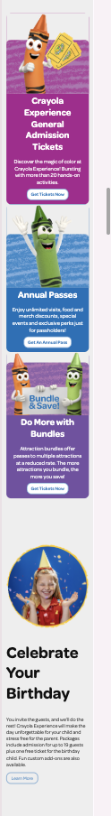

  ### Dit was lastig/Is niet gelukt:

  Het is me niet gelukt om het openklap hamburgermenu (mobile scherm) met deze styling te krijgen, Ik heb de navigatie menu op de desktop scherm wel geprobeerd en die is me gelukt. 

  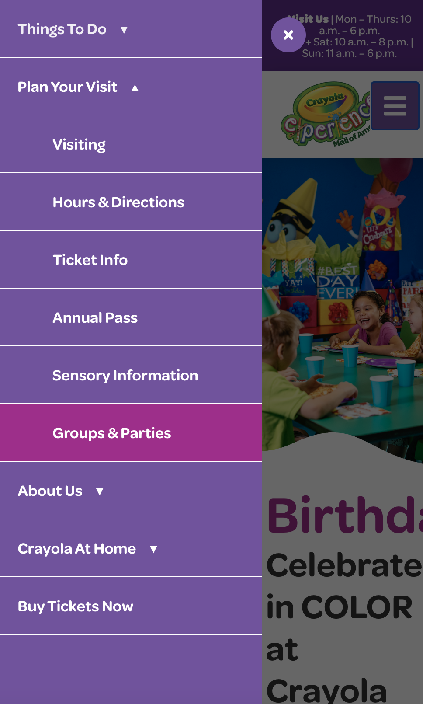

  Ik realiseerde me te laat dat deze section geen H'tje heeft. Zelfs als ik er een H'tje aan zou toevoegen, zou ik al mijn code opnieuw moeten aanpassen, wat me in tijdnood zou brengen. Dit was ook de enige foutmelding die ik kreeg van de validator, dus ik wilde geen risico nemen dat mijn code zou breken door aanpassingen te maken.

  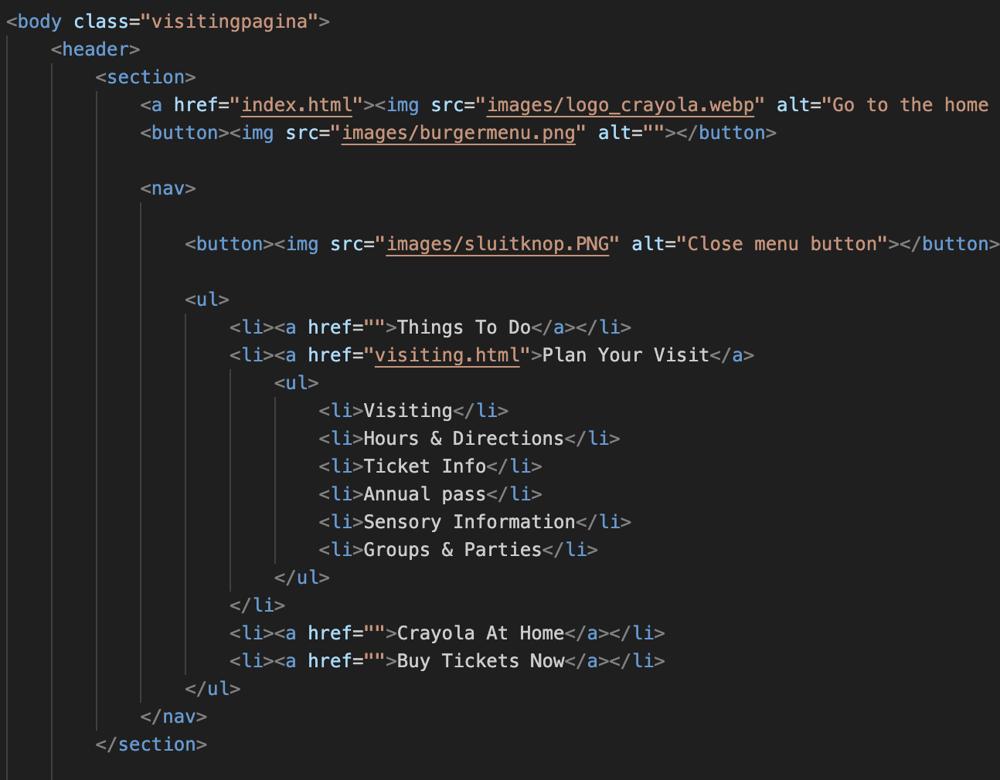

## Bronnenlijst

  
continu bijhouden terwijl je werkt

  Nb. Wees specifiek ('css-tricks' als bron is bijv. niet specifiek genoeg). 
  Nb. ChatGpT en andere AI horen er ook bij.
  Nb. Vermeld de bronnen ook in je code.

  1. Ik heb de SVG van de originele site gehaald die ik namaak.
  link naar site: https://crayolaexperiencemn.com/
  SVG gebruikt in code: 
    - svg xmlns="http://www.w3.org/2000/svg" viewBox="0 0 1000 100" preserveAspectRatio="none" aria-hidden="true">
			<path class="elementor-shape-fill" d="M790.5,93.1c-59.3-5.3-116.8-18-192.6-50c-29.6-12.7-76.9-31-100.5-35.9c-23.6-4.9-52.6-7.8-75.5-5.3
			c-10.2,1.1-22.6,1.4-50.1,7.4c-27.2,6.3-58.2,16.6-79.4,24.7c-41.3,15.9-94.9,21.9-134,22.6C72,58.2,0,25.8,0,25.8V100h1000V65.3
			c0,0-51.5,19.4-106.2,25.7C839.5,97,814.1,95.2,790.5,93.1z"></path>
		svg

  2. De code voor de navigatie sluitmenu, heb ik d.m.v. het maken van de opdrachten op DLO kunnen doen.
  code:
  let menuButton = document.querySelector("header section > button");
  let sluitButton = document.querySelector("header nav > button");

  menuButton.addEventListener("click", openMenu);
  sluitButton.addEventListener("click", sluitMenu);

  function openMenu(){
    let nav = document.querySelector("nav");
    nav.classList.add("toonMenu");
  }
  
  function sluitMenu(){
    let nav = document.querySelector("nav");
    nav.classList.remove("toonMenu");
  }
  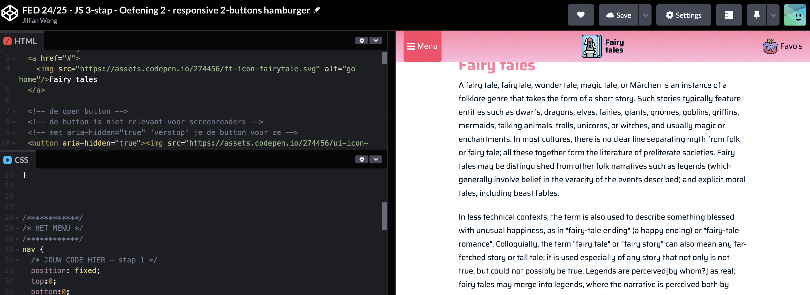

3. Ik heb Chat GPT gevraagd hoe ik een focus style kan plaatsen voor mijn code.
prompt: how to add a focus style for all elements at once?
antwoord: *:focus {
    outline: 2px solid #005fcc; /* Blue outline */
    box-shadow: 0 0 5px rgba(0, 95, 204, 0.7); /* Optional glow effect */
}

4. Ik heb op W3C de background-image property opgezocht, zodat ik ed achtergrond decoratie elementen kan toevoegen op deze manier.
Link naar website: https://www.w3schools.com/cssref/pr_background-image.php

Deze code stond er op de wesbite van W3C
body {
 background-image: url("paper.gif");
 background-color: #cccccc;
}

